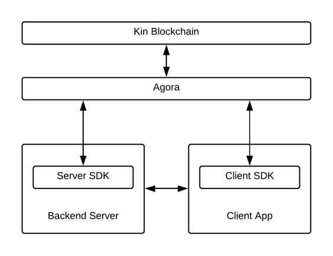

# Kin Go SDK tutorial series

Series agenda:
* This video - Introduction and initial gotchas
  * What do you need for transactions? Create account, send, spend.
* Invoices and earn batches
* Transaction monitoring and deduplication
* Security mitigations  
* Example webapp game integration with Kin
  
    

  
You can view your TEST transactions in the Solana explorer using the custom cluster address below.  
Solana explorer - https://explorer.solana.com/  
Update cluster address - Custom - https://local.validator.agorainfra.dev/7:03
